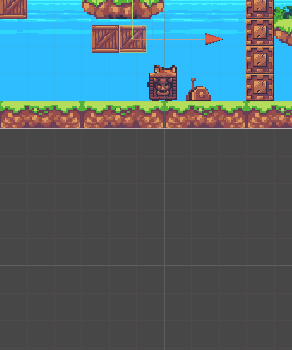

# Propiedades físicas en Unity

Este documento markdown prueba y explica el comportamiento de las diferentes configuraciones de objetos físicos en Unity. Usaremos un par de cajas para las pruebas.
Así, se propone la siguiente lista de pruebas:

### Ninguno de los objetos será físico.

En este caso, ningún objeto posee un rigidbody, así que las cajas no se mueven. Si tampoco poseen un collider asociado, los elementos estáticos no interactuarán con otros objetos que si poseen un collider.

### Un objeto tiene físicas y el otro no.

Como se puede ver, al configurar una de las caja como dinámica, esta es sometida a los valores de gravedad especificados en el editor de Unity. A esta caja le hemos asociado un collider, de manera que es capaz de interactuar con el suelo, evitando así caer al vacío.

### Ambos objetos tienen físicas.

Al configurarse ambas cajas como dinámicas, son capaces de ser afectadas por la gravedad a la escena. Además, si colocamos colliders a ambas, podemos observar que las cajas se afectan mutuamente al entrar en contacto. De esta manera, somos capaces de empujar las cajas con nuestro personaje, así como empujarlas indirectamente usando a una de ellas como barrera.

### Ambos objetos tienen físcas y uno de ellos tiene 10 veces más masa que el otro

Como se puede observar, la masa de un objeto afecta a los objetos dinámicos. A mayor masa, más complicado resulta mover un objeto. Del mismo modo, el objeto de mayor masa es capaz de mover a los elementos de su entorno con mayor facilidad.

### Un objeto tiene físicas y el otro es IsTrigger.

Los objetos marcados con la propiedad isTrigger pierden su collider y se transforman en objetos que se pueden atravesar con un efecto disparador asociado. Así, podemos observar que al marcar una de las cajas como isTrigger y retirarle su collider, somos capaces de atravesarla.

### Ambos objetos son físicos y uno de ellos está marcado como IsTrigger.

Al no poseer de un collider y ser un objeto dinámico, podemos observar que la caja con la propiedad dinámica atraviesa el terreno y cae al abismo.

### Uno de los objetos es cinemático.

La propiedad kinemática provoca que, como en el caso de los objetos estáticos, el objeto afectado pierda la capacidad de ser afectado por el entorno. Sin embargo, los objetos kinemáticos si que pueden afectar a los objetos de su entorno. Para demostrar este caso, utilizaremos un simple script con una curva de animación para hacer que una caja con la propiedad kinemática suba y baje en una zona específica del mapa. Como se puede observar en el gif, nuestros intentos de interactuar con la caja no surten efecto, mientras que la caja kinemática es capaz de empujar al personaje y el objeto que le sigue sin problemas.