# Fundamentos2
Actividades Técnicas de desarrollo 2D

#######################################

########## Actividad Sprites ##########

#######################################

(Escena 1 - Scripts PlayerController/GroundTrusth/EnemyDistanceCheck)

En esta práctica se han implementado dos animaciones al personaje, "Idle" y "Run". Se aplica Flip a los sprites cuando se cambia de sentido.

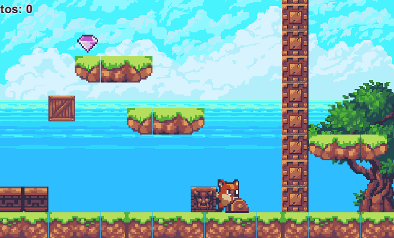

En tiempo de ejecución, la tecla X hace explotar al enemigo cuando se encuentra presente en pantalla.

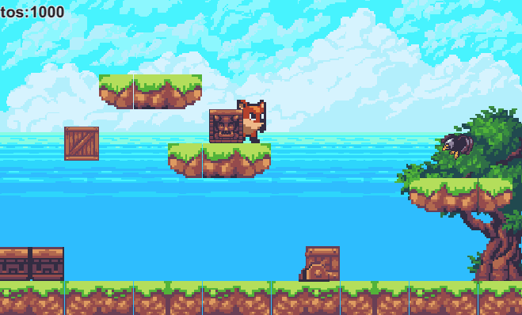

Cuando el jugador se aproxima al enemigo desde la zona superior, tocándolo, se genera una animación de explosión antes de destruirlo.

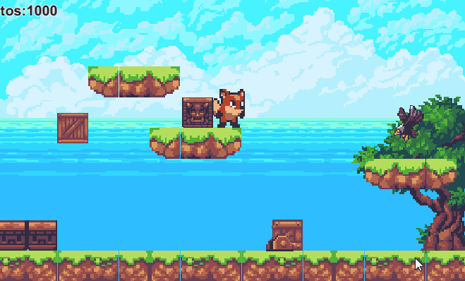

#######################################

########## Actividad Físicas ##########

#######################################

(Escena 1 - Scripts PlayerController/GroundTruth/DashPlatform/Ascensor)

En esta actividad se prepara una pequeña escena para jugar con los físicas de Unity. En el siguiente gif se pueden encontrar varios ejemplos de físicas, por ejemplo: 

· Una caja estática flotando en el aire,

· una caja kinemática que sube y baja mediante animaciones y que no se puede alterar, 

· o la caja dinámica que cae desde el cielo al activar la palanca.

El detalle referente a las distintas configuraciones físicas de Unity se encuentra localizado en el fichero markdown "Físicas"

Usando OnCollision y OnTrigger mostramos mensajes por consola.

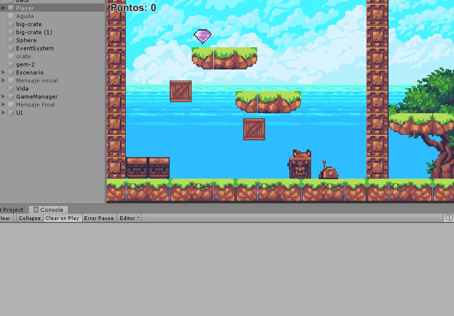

Referente a la incorporación de elementos físicos en la escena, se han incorporado:

Una barrera estática infranqueable.

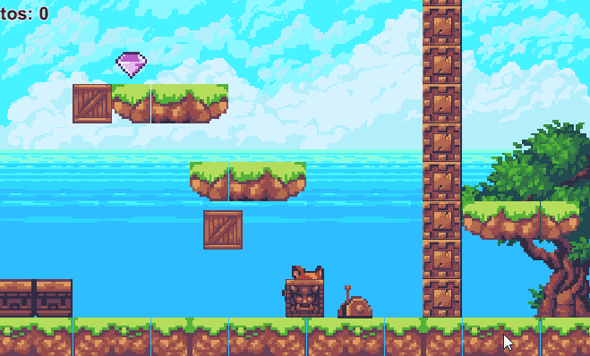

Una zona en la que los objetos que caen en ella son impulsados hacia delante.

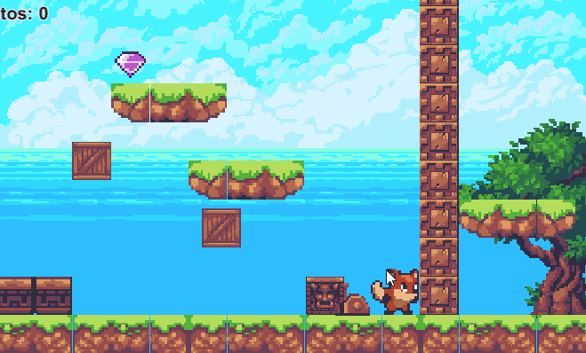

Un objeto que es arrastrado por otro a una distancia fija.

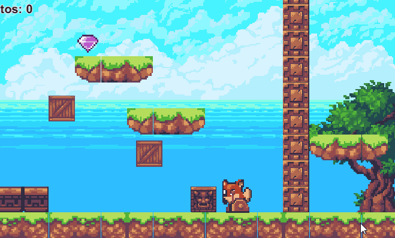

Un objeto que responde ante colisiones físicas.

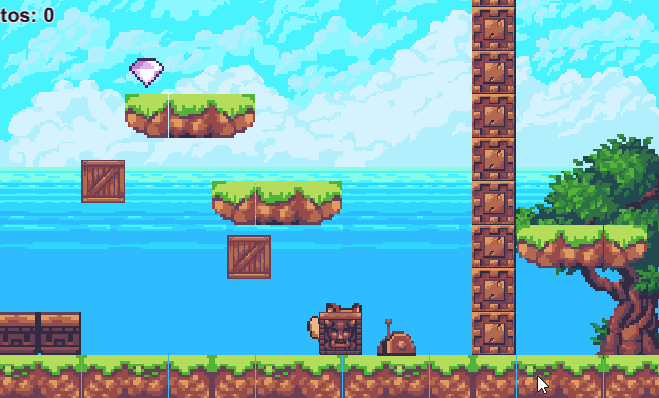

Utilización de capas para configuración de colisiones entre objetos.

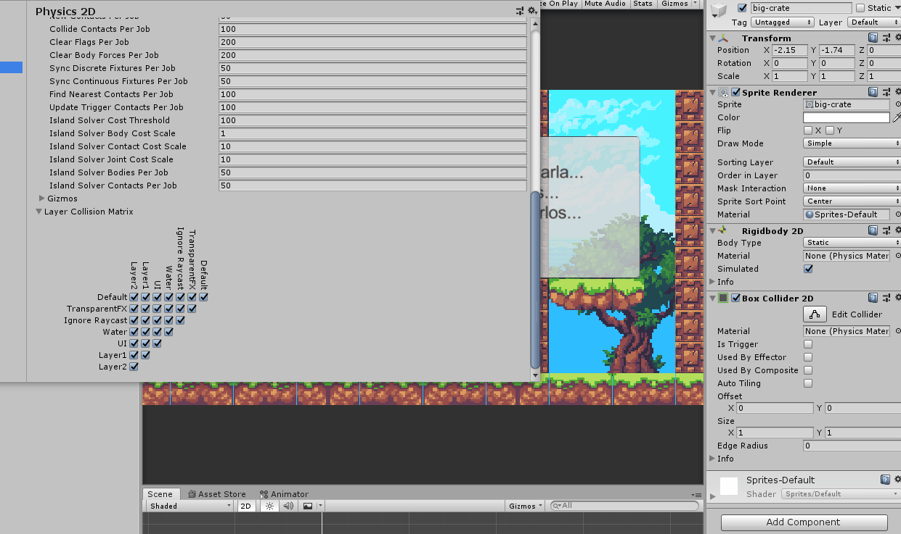

##########################################################

########## Actividad de generación de Tile Maps ##########

##########################################################

(Escena 1/Escena 2 - No hay scripts específicos asociados a esta práctica)

En esta práctica se aplican dos paletas:

La primera es una paleta de tiles regulares, con el que se construye el siguiente mapa. El mapa contiene obstáculos y barreras.

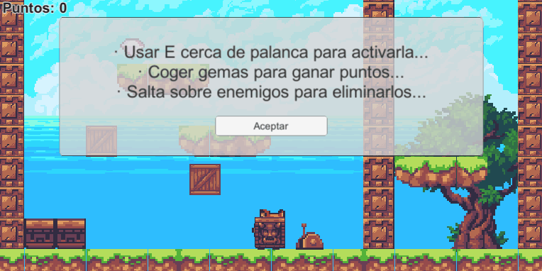

La segunda paleta utiliza tiles isométricos, para los que se han generado zonas elevadas que sirven de obstáculos.

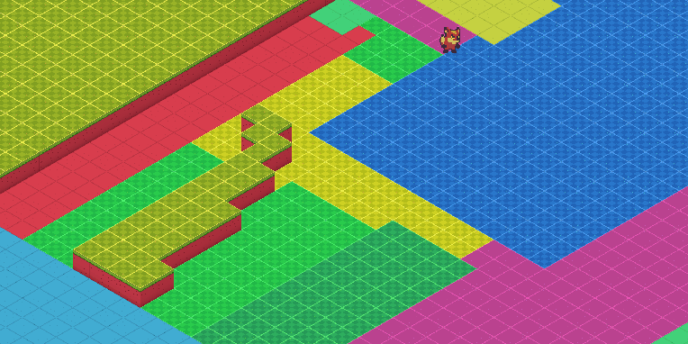
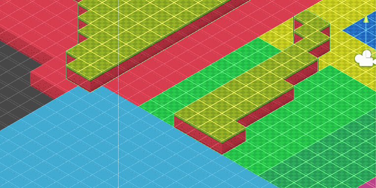

###########################################

########## Actividad de Técnicas ##########

###########################################

(Escena 1 - Scripts GameEvent/UnlockerEnter/LiftBarrier/EventSpawnEagle/GamePause/GameOver/HealthManager/Score/LeverAction)

Los eventos se controlan mediante la clase GameEvent. En este gif se puede observar varias instancias donde se utilizan eventos, por ejemplo:

· Inicio de partida mediante evebtos -> despausado de juego y retirada del cartel informativo al pulsar el botón "Aceptar".

· Evento al usar la palanca con la letra "E", dejando caer una caja física.

· Generación de varios comportamientos en base a un único evento subscrito por diferentes clases -> Al recoger la gema se agregan puntos al contador, retira una barrera e invoca a un enemigo

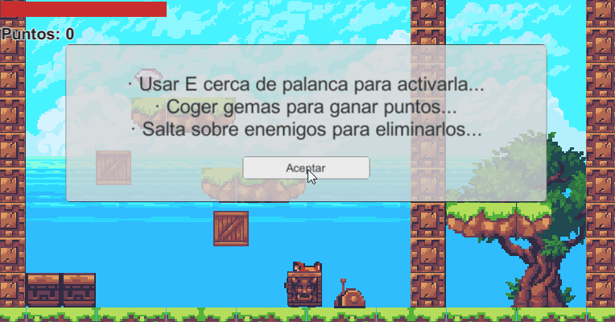

Además, en el siguiente gif se puede aprecias como, con eventos, se controla la vida del personaje (representada arriba a la izquierda) al entrar en contacto con un enemigo.

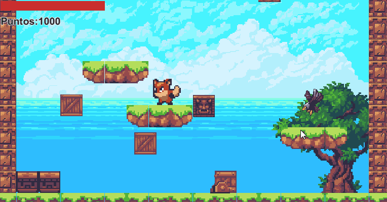

Por último, el fin de la partida se gestiona mediante eventos, de la misma manera que se controla el inicio. Así, cuando la vida del personaje llega a 0, se pausa la partida, se muestra un emnsaje y se reinicia la partida al pulsar el botón "Aceptar".

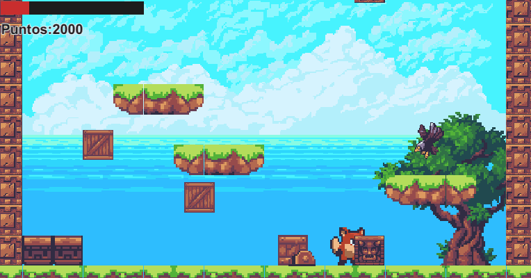

###########################################

########## Actividad de Técnicas ##########

###########################################

(Escena 3/Escena 4/Escena 5/Escena 6 - Scripts BoxToFace/Scroll/PCBGLoop/ScrollOnLimit/OnBorderLimit/RandomMovement/Pooler/EnemyDeathWithPool)

Escena con scroll de movimiento de fondo. Aparecen objetos sobre los que tiene que saltar el personaje.

Escena donde el scroll se aplica cuando el personaje abandona el fondo.

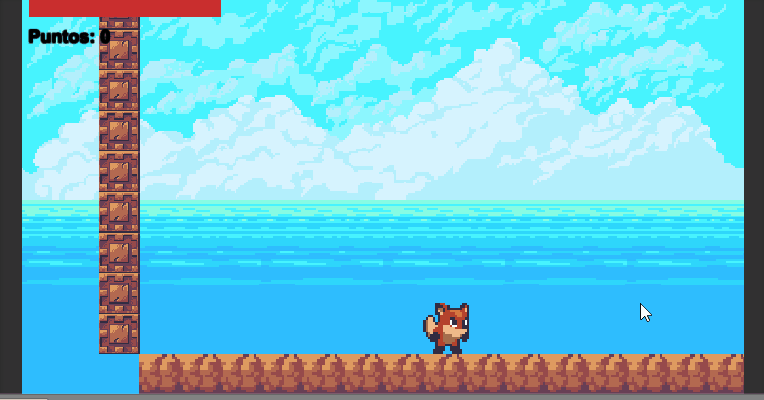

Fondo con efecto parallax. Diferentes elementos del fondo se despalzan a diferentes velocidades en función del movimiento del personaje. las piezas del fondo se desplazan para dar impresión de fondo continuo.

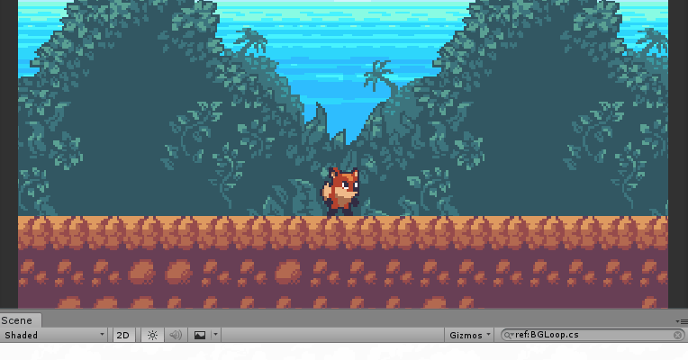

Uso de pool de objetos para generar enemigos sobre los que el personaje puede saltar para obtener puntos.

########################################################

########## Actividad de controlador de cámara ##########

########################################################

(Escena 7 - Scripts CameraChange/ImpulseOnContact/VibrationOnClick)

En el primer gif se puede apreciar como se utiliza cinemachine para crear 3 cámaras virtuales controladas mediante las teclas "B", "N" y "M":

· Una cámara virtual A que sigue al personaje

· Una cámara B que sigue al áquila con un mayor área de seguimiento

· Una cámara C que sigue tanto al personaje como al águila mediante el uso de target groups de cinemachine

Las cámaras A y C tienen un área de confinamiento que abarca el total de la escena. La cámara B posee un área de confinamiento más limitada.

Además, se incorporan elementos a la escena que aplican vibración a las cámaras mediante el sistema de impulsos de cinemachine. hay dos formas de hacer vibrar la cámara:

· Tocando la cámara, que tiene un "impulse source" asociado

· Apretando el click izquierdo del ratón, que activa la condición 

